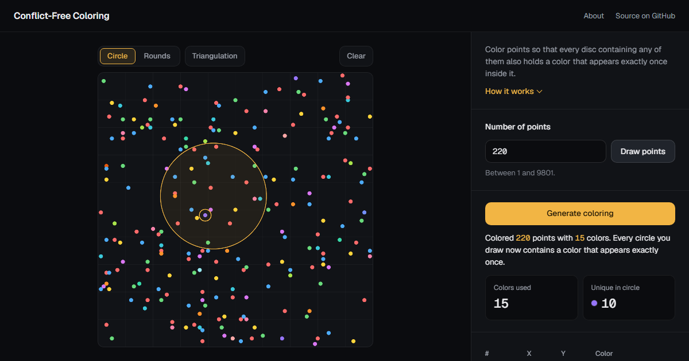

# Conflict-Free Coloring Simulator

An interactive simulator of an algorithm for **conflict-free coloring of points with respect to discs**. Draw points, run the algorithm, then test the result by drawing circles or replaying it round by round.

**Live demo:** https://nirkem.github.io/Conflict-free-coloring/



## The problem

Color a set of points in the plane so that every disc containing at least one point also contains a point whose color is **unique** in that disc. The goal is to use as few colors as possible.

The problem comes from frequency assignment in cellular networks: antennas are the points, colors are frequencies, and a phone anywhere must hear at least one antenna on a frequency that no other antenna in range uses.

## The algorithm

Based on Even, Lotker, Ron and Smorodinsky (2003). While points remain:

1. Build the **Delaunay triangulation** of the remaining points.
2. Color that graph so neighbors get different colors, and keep the **largest color class**. It is an independent set: no two of its points are Delaunay neighbors.
3. Give that set the **next color** and remove it.

**Why it works.** Any disc holding two or more of the remaining points contains a Delaunay edge between two of them, so those points never all leave in the same round. As a result, the highest color inside any disc appears exactly once.

**How many colors.** The Delaunay triangulation is planar. The original paper 4-colors it (Four Color Theorem), so each round removes at least a quarter of the points. This simulator uses a fast greedy coloring in smallest-last order instead, which needs at most 6 colors on a planar graph, so each round removes at least a sixth. Either way the number of colors is **O(log n)**.

## Using the simulator

| Control | What it does |
| --- | --- |
| **Draw points** | Places up to 9801 distinct random points on a 100x100 grid. |
| **Generate coloring** | Runs the algorithm. Colors appear round by round, lowest first. |
| **Circle** | Drag a disc on the canvas. Its highest color is shown live, and the page verifies that it really appears only once. |
| **Rounds** | Replays the algorithm one color at a time (buttons, Play, or the arrow keys). Earlier colors fade, remaining points show their Delaunay graph, and this round's points light up. |
| **Triangulation** | Overlays the Delaunay graph of all points. |
| **Table** | Lists every point. Hovering a row highlights its point on the canvas, and the other way around. |

The **About** link at the top reopens the introduction.

## Running it locally

No build step and no dependencies to install:

```bash
git clone https://github.com/nirkem/Conflict-free-coloring.git
```

Then open `index.html` in a modern browser. Everything runs offline.

## Project structure

| File | Contents |
| --- | --- |
| `index.html` | Page structure and the About dialog |
| `styles.css` | Dark theme, layout and motion |
| `script.js` | Canvas drawing, tools, and the coloring algorithm |
| `vendor/delaunator.min.js` | [Delaunator](https://github.com/mapbox/delaunator) 5.0.0 for Delaunay triangulation (ISC license) |
| `fonts/` | [Geist](https://vercel.com/font) and Geist Mono (SIL Open Font License) |

## Reference

G. Even, Z. Lotker, D. Ron and S. Smorodinsky. *Conflict-Free Colorings of Simple Geometric Regions with Applications to Frequency Assignment in Cellular Networks.* SIAM Journal on Computing 33(1), 2003.

## Authors

Created by Nir Michalovitz and Omer Levy.
